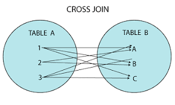

# SQL: CROSS JOIN

Nesta seção exploramos o uso do **CROSS JOIN** no Oracle SQL, uma junção especial que gera **todas as combinações possíveis** entre os registros de duas tabelas. Esse tipo de junção é conhecido como **produto cartesiano**.

---

## 🔹 O que é CROSS JOIN?

O `CROSS JOIN` combina cada linha da primeira tabela com **todas as linhas da segunda tabela**, gerando uma matriz de combinações.

> Se a Tabela A tem 5 linhas e a Tabela B tem 3 linhas, o resultado do CROSS JOIN será 5 × 3 = 15 linhas.

---

## 🔹 Estrutura das Tabelas Usadas

Neste exemplo, usamos duas tabelas simples:

- `dias_semana`: representa os dias úteis da semana.
- `turnos`: representa os períodos do dia (manhã, tarde, noite).

Relacionamento:

```text
(Nenhum relacionamento direto — o CROSS JOIN combina tudo com tudo)
```

---

## 🔹 Script de Criação e Dados

```sql
-- Tabela com os dias da semana
CREATE TABLE dias_semana (
    id NUMBER PRIMARY KEY,
    dia VARCHAR2(20)
);

-- Tabela com turnos disponíveis
CREATE TABLE turnos (
    id NUMBER PRIMARY KEY,
    turno VARCHAR2(20)
);

-- Inserção de dias úteis
INSERT INTO dias_semana VALUES (1, 'Segunda-feira');
INSERT INTO dias_semana VALUES (2, 'Terça-feira');
INSERT INTO dias_semana VALUES (3, 'Quarta-feira');
INSERT INTO dias_semana VALUES (4, 'Quinta-feira');
INSERT INTO dias_semana VALUES (5, 'Sexta-feira');

-- Inserção de turnos
INSERT INTO turnos VALUES (1, 'Manhã');
INSERT INTO turnos VALUES (2, 'Tarde');
INSERT INTO turnos VALUES (3, 'Noite');
```

---

## 🔹 Exemplo de CROSS JOIN

```sql
SELECT 
    dia, turno
FROM 
    dias_semana
CROSS JOIN 
    turnos;
```

---

## 🔍 Resultado Esperado (15 linhas)

| dia           | turno  |
|---------------|--------|
| Segunda-feira | Manhã  |
| Segunda-feira | Tarde  |
| Segunda-feira | Noite  |
| Terça-feira   | Manhã  |
| Terça-feira   | Tarde  |
| Terça-feira   | Noite  |
| ...           | ...    |
| Sexta-feira   | Noite  |

---

## 🔹 Aplicações Práticas

- Gerar **grades de horário** (como no exemplo acima).
- Criar **tabelas de referência** para cruzamentos (por exemplo: matriz de permutas).
- Simular **todas as combinações possíveis** entre dois conjuntos (ex: produtos × cores).

---

## ⚠️ Atenção

- O `CROSS JOIN` pode gerar muitos resultados rapidamente (exponencial).
- Use com tabelas pequenas ou com filtros específicos se estiver em produção.

---

## 🔹 Equivalência

Este comando é equivalente:

```sql
SELECT 
    dia, turno
FROM 
    dias_semana, turnos;
```

> Mas o uso explícito de `CROSS JOIN` é mais claro e recomendado para legibilidade.

---

## 🔹 Visualização

A imagem abaixo representa graficamente o funcionamento do CROSS JOIN:



---

