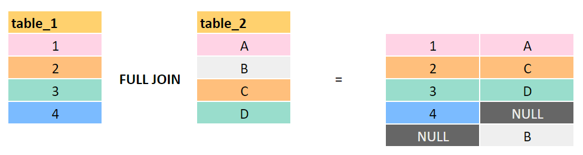

# SQL: FULL OUTER JOIN

Esta seção explora o uso do **FULL OUTER JOIN** no Oracle SQL, utilizando como exemplo um cenário educacional: alunos e entregas de atividades. O `FULL OUTER JOIN` é ideal para identificar **registros não correspondentes em ambas as tabelas**.

---

## 🔹 O que é FULL OUTER JOIN?

O `FULL OUTER JOIN` retorna:

- Todos os registros da **tabela da esquerda (LEFT)**.
- Todos os registros da **tabela da direita (RIGHT)**.
- Preenche com `NULL` onde não houver correspondência entre elas.

> É a combinação dos comportamentos do `LEFT JOIN` e `RIGHT JOIN`.

---

## 🔹 Estrutura das Tabelas

Neste exemplo, temos:

- `alunos`: lista de alunos cadastrados.
- `atividades`: atividades entregues por alunos.

Relacionamento entre elas:

```sql
atividades.aluno_id = alunos.id
```

---

## 🔹 Exemplo – Alunos com ou sem entregas (e entregas com ou sem alunos)

```sql
SELECT *
FROM alunos
FULL OUTER JOIN atividades ON alunos.id = atividades.aluno_id;
```

✅ Essa consulta mostra:

- Todos os alunos, inclusive os que **não entregaram nenhuma atividade**.
- Todas as entregas, inclusive as feitas por alunos **não cadastrados**.

---

## 🔹 Interpretação do Resultado

| aluno.id | aluno.nome | atividade.id | atividade.aluno_id | atividade.titulo     |
|----------|------------|---------------|---------------------|----------------------|
| 1        | Ana        | 1             | 1                   | Redação 1            |
| 1        | Ana        | 2             | 1                   | Redação 2            |
| 2        | Bruno      | 3             | 2                   | Trabalho de História |
| 3        | Carla      | NULL          | NULL                | NULL                 |
| 4        | Daniel     | NULL          | NULL                | NULL                 |
| NULL     | NULL       | 4             | 99                  | Atividade Fantasma   |

---

## 🔹 Casos Combinados

- 👈 **LEFT JOIN:** alunos como Carla e Daniel aparecem mesmo sem entregas.
- 👉 **RIGHT JOIN:** a entrega feita pelo aluno_id `99` aparece mesmo que esse aluno não esteja cadastrado.

---

## 🔹 Quando usar FULL OUTER JOIN?

- Verificar **ausência de correspondência em ambos os lados**.
- Comparar listas incompletas (ex: base de dados externa vs. interna).
- Gerar relatórios de inconsistência e auditoria.

---

## 🔹 Representação Visual

A imagem abaixo ilustra o comportamento do `FULL OUTER JOIN`:



---

