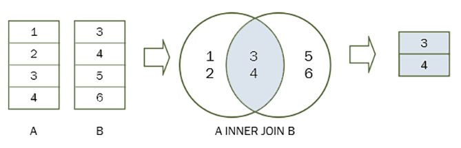

# SQL: INNER JOIN

Esta seção aborda o uso do **INNER JOIN** em SQL, uma das cláusulas mais fundamentais na manipulação de dados relacionais. O `INNER JOIN` permite a união de tabelas diferentes com base em valores que possuem em comum.

---

## 🔹 O que é o INNER JOIN?

O `INNER JOIN` retorna:

- Apenas os registros que possuem **valores correspondentes em ambas as tabelas** envolvidas.
- Os registros que **não têm correspondência em pelo menos uma das tabelas são descartados** do resultado.

> É a forma mais comum de combinar dados relacionados entre tabelas diferentes.

---

## 🔹 Estrutura de Tabelas Usadas

Neste exemplo, consideramos:

- `clientes`: contém informações de pessoas físicas ou jurídicas cadastradas.
- `pedidos`: armazena os pedidos realizados por esses clientes.

Relacionamento entre elas:

```sql
pedidos.id_cliente = clientes.id
```

---

## 🔹 Exemplo – Selecionar pedidos com seus respectivos clientes

```sql
SELECT 
    pedidos.id AS id_pedido,
    pedidos.data,
    pedidos.valor_total,
    clientes.id AS id_cliente,
    clientes.nome
FROM 
    pedidos
INNER JOIN 
    clientes ON pedidos.id_cliente = clientes.id;
```

✅ Apenas os pedidos que têm um cliente válido cadastrado serão retornados.

---

## 🔹 Visualização Comparativa

A imagem abaixo ilustra graficamente o `INNER JOIN`. Apenas a **interseção** entre os dados das duas tabelas (registros com correspondência) será incluída no resultado.



---

## 🔹 Quando usar INNER JOIN?

- Ao relacionar pedidos com clientes.
- Ao cruzar vendas com produtos.
- Ao montar relatórios que exigem **dados completos e com vínculo**.

> Ideal quando você deseja **apenas dados relacionados entre tabelas**.

---

## 🔹 Comparação com outros JOINs

| JOIN Type       | O que retorna                                                         |
|------------------|------------------------------------------------------------------------|
| INNER JOIN       | Apenas registros com correspondência entre as duas tabelas            |
| LEFT JOIN        | Todos os da esquerda + correspondência da direita (ou NULL)           |
| RIGHT JOIN       | Todos os da direita + correspondência da esquerda (ou NULL)           |
| FULL OUTER JOIN  | Todos os registros das duas tabelas, combinando quando possível       |

---

## 🔹 Dica Final

> O `INNER JOIN` é ideal para consultas onde **só fazem sentido os dados vinculados entre si**.
>
> Ele elimina automaticamente registros sem relação — o que garante integridade, mas também pode ocultar dados órfãos.

---

