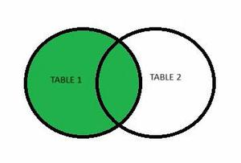

# Left Join em Oracle SQL

Esta seção explora o uso do **LEFT JOIN** (também conhecido como **LEFT OUTER JOIN**) no Oracle SQL, uma das operações mais importantes para consultas relacionais que envolvem múltiplas tabelas.

O `LEFT JOIN` permite combinar registros de duas tabelas, **mantendo todos os registros da tabela da esquerda**, mesmo que **não haja correspondência** na tabela da direita.

---

## 🔹 O que é LEFT JOIN?

O `LEFT JOIN` retorna:

- **Todas as linhas da tabela à esquerda** do JOIN.
- Os dados da tabela da direita **apenas quando existe correspondência**.
- Caso contrário, os campos da tabela da direita aparecem como `NULL`.

> É especialmente útil para identificar **ausência de relacionamentos**, gerar relatórios completos ou verificar inconsistências no banco de dados.

---

## 🔹 Estrutura das Tabelas Usadas

Neste exemplo, utilizamos as tabelas fictícias:

- `pessoas`: cadastro com nomes e cidades.
- `compras`: produtos adquiridos por essas pessoas.

A relação entre elas se dá por meio da chave estrangeira:

```sql
compras.pessoa_id = pessoas.id
```

---

## 🔹 Exemplo 1 – Listar todas as compras, mesmo sem pessoa associada

Aqui priorizamos a tabela `compras`, ou seja, queremos **todas as compras**, ainda que a pessoa que realizou a compra **não exista mais** (ou o dado esteja inconsistente).

```sql
SELECT 
    compras.id AS id_compra,
    compras.produto,
    compras.valor,
    pessoas.id AS id_pessoa,
    pessoas.nome,
    pessoas.cidade
FROM 
    compras
LEFT JOIN 
    pessoas ON compras.pessoa_id = pessoas.id;
```

- Se `pessoa_id` não existir, os campos `nome` e `cidade` virão como `NULL`.
- Excelente para identificar compras inválidas ou registros "órfãos".

---

## 🔹 Exemplo 2 – Listar todas as pessoas, mesmo sem compras

Neste caso, usamos `pessoas` como tabela principal, retornando **todas as pessoas cadastradas**, mesmo que **nunca tenham feito nenhuma compra**.

```sql
SELECT 
    pessoas.id AS id_pessoa,
    pessoas.nome,
    pessoas.cidade,
    compras.id AS id_compra,
    compras.produto,
    compras.valor
FROM 
    pessoas
LEFT JOIN 
    compras ON pessoas.id = compras.pessoa_id;
```

- Se a pessoa não tiver compras, os campos da tabela `compras` virão como `NULL`.
- Muito útil para identificar **clientes inativos** ou gerar relatórios de reengajamento.

---

## 🔹 Comparativo: INNER JOIN vs LEFT JOIN

| JOIN Type     | Resultado                                          |
|---------------|----------------------------------------------------|
| INNER JOIN    | Apenas registros com correspondência nas duas tabelas |
| LEFT JOIN     | Todos os registros da esquerda + correspondência à direita (ou NULL) |

---

## 🔹 Representação Visual (Left Join)

A imagem abaixo ilustra o comportamento do `LEFT JOIN`, onde o conjunto A (tabela da esquerda) é mantido integralmente, enquanto o conjunto B (tabela da direita) aparece apenas quando há relação.



---

## 🔹 Aplicações Práticas

- Encontrar registros com dados incompletos.
- Criar relatórios que incluem “ausências” (ex: alunos sem nota, clientes sem pedido).
- Diagnosticar falhas em integrações de sistemas ou importações.

---

## 🔹 Dica Final

> O que está à **esquerda** do `LEFT JOIN` **nunca será descartado**.
>
> Os campos da **tabela da direita** virão como `NULL` se não houver correspondência.

---
