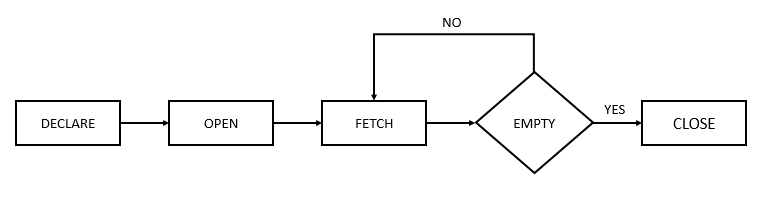

# Cursores no PL/SQL

Este diretório contém scripts SQL relacionados ao **uso de cursores explícitos e otimizados no PL/SQL**. Cursores são utilizados para percorrer registros de uma consulta SQL, permitindo manipulação linha por linha dentro de blocos PL/SQL.

## 🔹 O que são Cursores?
No PL/SQL, um **cursor** é um ponteiro para um conjunto de resultados de uma consulta SQL. Ele permite que os dados sejam processados **linha por linha** dentro de um bloco PL/SQL.


Existem dois tipos principais de cursores:
- **Cursores Explícitos** → Definidos manualmente pelo programador, oferecem maior controle sobre a recuperação de dados.
- **Cursores Implícitos** → Criados automaticamente pelo Oracle para armazenar os resultados de uma consulta SQL simples.

---

## 🔹 Cursores Explícitos
Os **cursores explícitos** são declarados pelo programador e seguem quatro etapas principais:
1. **Declaração** (`DECLARE`) → Define o cursor e sua consulta SQL.
2. **Abertura** (`OPEN`) → Executa a consulta e prepara os registros para leitura.
3. **Busca de Dados** (`FETCH`) → Recupera uma linha do cursor e armazena em variáveis.
4. **Fechamento** (`CLOSE`) → Libera os recursos alocados pelo cursor.


#### **Exemplo de Cursor Explícito**
```sql
DECLARE 
  -- Declaração do cursor
  CURSOR c_emps IS 
    SELECT first_name, last_name FROM employees;
  
  -- Variáveis para armazenar os dados do cursor
  v_first_name employees.first_name%TYPE;
  v_last_name employees.last_name%TYPE;

BEGIN 
  -- Abre o cursor
  OPEN c_emps;
  
  -- Busca um único registro do cursor
  FETCH c_emps INTO v_first_name, v_last_name;
  
  -- Exibe os valores recuperados
  DBMS_OUTPUT.PUT_LINE(v_first_name || ' ' || v_last_name);

  -- Fecha o cursor
  CLOSE c_emps;
END; 
/
```
## 🔹 Uso de Looping com Cursores no PL/SQL

Os **cursores explícitos** no PL/SQL permitem recuperar registros **linha por linha**, e o uso de **loops** facilita a iteração sobre os resultados de uma consulta SQL. Em vez de buscar apenas um registro com `FETCH`, podemos usar loops para processar **todos os registros do cursor**.

---

### 🔹 **Percorrendo Cursores com `LOOP`**
Quando usamos um cursor explícito, precisamos:
1. **Abrir o cursor (`OPEN cursor_name;`)**.
2. **Buscar os registros (`FETCH cursor_name INTO variáveis;`)**.
3. **Encerrar o cursor (`CLOSE cursor_name;`)**.
4. **Utilizar um `LOOP` para processar todos os registros**.

#### **Exemplo de Cursor com `LOOP`**
```sql
DECLARE 
  -- Declaração do cursor que retorna nomes de funcionários e seus departamentos
  CURSOR c_emps IS 
    SELECT first_name, last_name, department_name  
    FROM employees 
    JOIN departments USING (department_id) 
    WHERE department_id BETWEEN 30 AND 60;
  
  -- Variáveis para armazenar os valores do cursor
  v_first_name employees.first_name%TYPE;
  v_last_name employees.last_name%TYPE;
  v_department_name departments.department_name%TYPE;

BEGIN 
  -- Abre o cursor
  OPEN c_emps;
  
  -- Percorre todos os registros do cursor usando um loop
  LOOP
    FETCH c_emps INTO v_first_name, v_last_name, v_department_name;
    EXIT WHEN c_emps%NOTFOUND; -- Sai do loop quando não houver mais registros
    
    -- Exibe os valores recuperados
    DBMS_OUTPUT.PUT_LINE(v_first_name || ' ' || v_last_name || ' - ' || v_department_name);
  END LOOP;
  
  -- Fecha o cursor
  CLOSE c_emps;
END;
/
