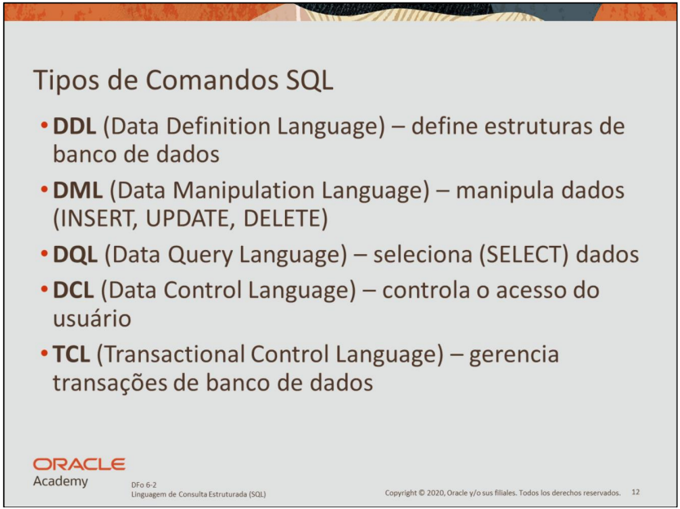

# Tipos de Comandos SQL

O SQL (Structured Query Language) é dividido em diferentes categorias de comandos, conforme sua função no gerenciamento e manipulação de bancos de dados relacionais.

Neste diretório, vamos explorar os principais **tipos de comandos SQL**, divididos em cinco grupos:

---

## 🔷 1. DDL - Data Definition Language

Comandos de **definição de dados** são usados para **criar, alterar ou excluir estruturas** no banco de dados, como tabelas, esquemas e índices.

- Exemplos:  
  `CREATE`, `ALTER`, `DROP`, `TRUNCATE`

---

## 🔷 2. DML - Data Manipulation Language

Comandos de **manipulação de dados** são utilizados para **inserir, atualizar ou excluir registros** já existentes em tabelas.

- Exemplos:  
  `INSERT`, `UPDATE`, `DELETE`

---

## 🔷 3. DQL - Data Query Language

Comandos de **consulta de dados**. Normalmente, esse grupo é representado pelo comando `SELECT`, que permite **consultar e visualizar dados** das tabelas.

- Exemplos:  
  `SELECT`

---

## 🔷 4. DCL - Data Control Language

Comandos de **controle de acesso** usados para definir **permissões de usuários** no banco de dados, como conceder ou revogar privilégios.

- Exemplos:  
  `GRANT`, `REVOKE`

---

## 🔷 5. TCL - Transaction Control Language

Comandos usados para **gerenciar transações** no banco de dados, permitindo confirmar (`COMMIT`) ou desfazer (`ROLLBACK`) operações feitas em bloco.

- Exemplos:  
  `COMMIT`, `ROLLBACK`, `SAVEPOINT`

---

