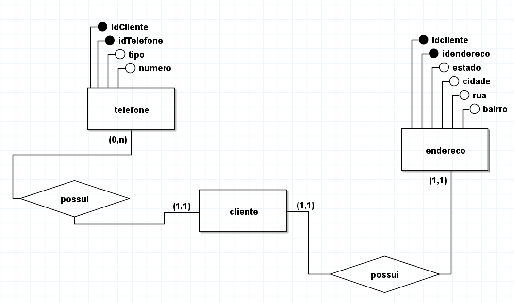

<h1>Banco de Dados Comerciais - README</h1>
<h2>Este repositório contém um script SQL que cria um banco de dados para gerenciar informações sobre clientes, endereços e telefones em um contexto comercial. Abaixo, discutiremos as foreign keys (chaves estrangeiras) e os
 relacionamentos 1x1, 1xN presentes no banco de dados.</h2>

<h1>O que é uma chave estrangeira?</h1>

Uma chave estrangeira, ou "foreign key" em inglês, é um conceito em bancos de dados relacionais que estabelece uma relação entre duas tabelas. Ela é uma coluna ou conjunto de colunas em uma tabela que faz referência à chave primária de outra tabela. Essa referência cria um vínculo lógico entre as duas tabelas, permitindo que uma delas utilize as chaves primárias da outra para estabelecer relacionamentos.

Em termos mais simples, a chave estrangeira é usada para garantir a integridade referencial entre tabelas. Isso significa que os valores presentes na coluna que serve como chave estrangeira em uma tabela devem corresponder aos valores existentes na coluna de chave primária da tabela referenciada.

<h3>Tabelas do Banco de Dados</h3>

<h4>Tabela CLIENTE:</h4>

Armazena informações sobre os clientes, como nome, sexo, e-mail e CPF.
Chave Primária: idCliente (AUTO_INCREMENT)

<h4>Tabela ENDERECO:</h4>

Contém informações sobre os endereços dos clientes.
Chave Primária: idEndereco (AUTO_INCREMENT)
Chave Estrangeira: idCliente (referência à tabela CLIENTE)
Relacionamento: 1x1 (um cliente tem no máximo um endereço)

<h4>Tabela TELEFONE:</h4>

Armazena informações sobre os telefones dos clientes.
Chave Primária: idTelefone (AUTO_INCREMENT)
Chave Estrangeira: idCliente (referência à tabela CLIENTE)
Relacionamento: 1xN (um cliente pode ter vários telefones)

<h3>Cardinalidades e Chaves Estrangeiras</h3>

<h4>Relacionamento 1x1 (CLIENTE -> ENDERECO):</h4>

A tabela ENDERECO possui uma chave estrangeira (idCliente) que faz referência à chave primária (idCliente) da tabela CLIENTE.
Isso implica que cada cliente tem no máximo um endereço associado.

<h4>Relacionamento 1xN (CLIENTE -> TELEFONE):</h4>

A tabela TELEFONE possui uma chave estrangeira (idCliente) que faz referência à chave primária (idCliente) da tabela CLIENTE.
Isso indica que um cliente pode ter vários telefones associados.

