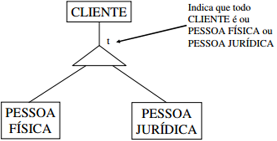

# Generalização, Especialização e Supertipos/Subtipos

Esta seção aborda os conceitos de **generalização**, **especialização**, **supertipos** e **subtipos**, fundamentais na modelagem conceitual de dados. Esses conceitos são usados para representar **hierarquias de entidades**, agrupando ou refinando dados conforme suas características comuns ou específicas.

---

## 🔹 O que é um Supertipo?

O **supertipo** é uma entidade **mais genérica**, que contém os **atributos e relacionamentos compartilhados** entre um ou mais subtipos.

- Serve como **entidade-pai**.
- Centraliza informações comuns a todas as especializações.
- Exemplo: `CLIENTE` pode ser o supertipo de `PESSOA FÍSICA` e `PESSOA JURÍDICA`.

---

## 🔹 O que é um Subtipo?

Um **subtipo** representa uma **especialização** do supertipo. Ele possui atributos próprios que não são compartilhados com os outros subtipos.

- Herda os atributos do supertipo.
- Possui seus próprios campos específicos.
- Exemplo: `PESSOA FÍSICA` pode ter `CPF`, enquanto `PESSOA JURÍDICA` terá `CNPJ`.

---

## 🔹 Especialização vs Generalização

| Termo              | Definição                                                                           |
|--------------------|--------------------------------------------------------------------------------------|
| **Especialização** | Processo de criar subtipos a partir de um supertipo, refinando uma entidade geral. |
| **Generalização**  | Processo inverso: agrupar subtipos em um supertipo com atributos em comum.          |

---

## 🔹 Exemplo Visual (Especialização)

A imagem abaixo ilustra uma **especialização**, onde a entidade genérica `CLIENTE` é especializada em dois subtipos: `PESSOA FÍSICA` e `PESSOA JURÍDICA`.



- O triângulo com a letra `t` indica que **todo CLIENTE deve ser obrigatoriamente uma PESSOA FÍSICA ou uma PESSOA JURÍDICA** (especialização total).
- Atributos como `nome`, `telefone`, etc. ficam em `CLIENTE`.
- `PESSOA FÍSICA` traz atributos como `CPF`, `data_nascimento`.
- `PESSOA JURÍDICA` traz atributos como `CNPJ`, `razao_social`.

---

## 🔹 Representação Conceitual (DER)

Em um **Diagrama Entidade-Relacionamento (DER)**, a estrutura hierárquica é representada assim:

```text
           CLIENTE
               │
     ┌─────────┴─────────┐
PESSOA FÍSICA     PESSOA JURÍDICA
