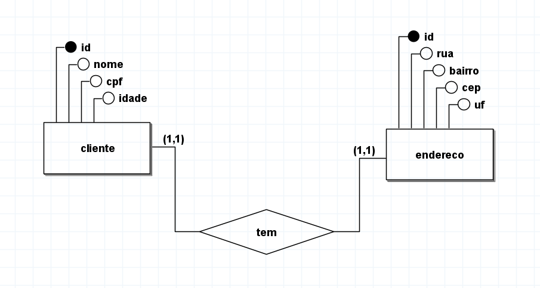

# Primeira Forma Normal (1NF)

A primeira forma normal (1NF) é o primeiro nível de normalização de um banco de dados. Ela garante que cada valor em uma tabela seja atômico, ou seja, não possa ser dividido em partes menores. Além disso, a 1NF também exige que cada tabela tenha uma chave primária, que é um valor exclusivo que identifica cada linha da tabela.

Critérios da 1NF

Cada valor em uma tabela deve ser atômico. Isso significa que cada célula da tabela deve conter apenas um valor. Por exemplo, uma tabela de clientes não pode ter uma coluna nome que contenha o nome completo do cliente, pois isso seria um valor composto. Em vez disso, a coluna deve ser dividida em duas colunas, nome_primeiro e nome_último.
Cada tabela deve ter uma chave primária. Uma chave primária é um valor exclusivo que identifica cada linha da tabela. Por exemplo, uma tabela de clientes pode ter uma chave primária composta pelas colunas id_cliente e cpf.
Benefícios da 1NF

A 1NF oferece uma série de benefícios, incluindo:

Melhora a integridade dos dados. Ao exigir que cada valor em uma tabela seja atômico, a 1NF ajuda a garantir que os dados sejam precisos e consistentes.
Facilita a consulta dos dados. Ao ter uma chave primária para cada tabela, é mais fácil consultar os dados, pois é possível usar a chave primária para identificar as linhas específicas que deseja consultar.
Facilita a manutenção dos dados. Ao dividir os valores compostos em colunas separadas, a 1NF torna mais fácil adicionar novos dados e fazer alterações nos dados existentes.
Exemplo

Considere a seguinte tabela de clientes:

| id_cliente | nome | endereço |
|---|---|---|
| 1 | João da Silva | Rua da Paz, 123 |
| 2 | Maria da Costa | Avenida da Liberdade, 456 |
Esta tabela não está na primeira forma normal, pois a coluna nome contém um valor composto. Para colocar esta tabela na primeira forma normal, devemos dividir a coluna nome em duas colunas, nome_primeiro e nome_último:

| id_cliente | nome_primeiro | nome_último | endereço |
|---|---|---|---|
| 1 | João | da Silva | Rua da Paz, 123 |
| 2 | Maria | da Costa | Avenida da Liberdade, 456 |
Esta nova tabela está na primeira forma normal, pois cada valor em uma tabela é atômico e a tabela tem uma chave primária composta pelas colunas id_cliente e nome_primeiro e nome_último.

### Exemplo de modelo
