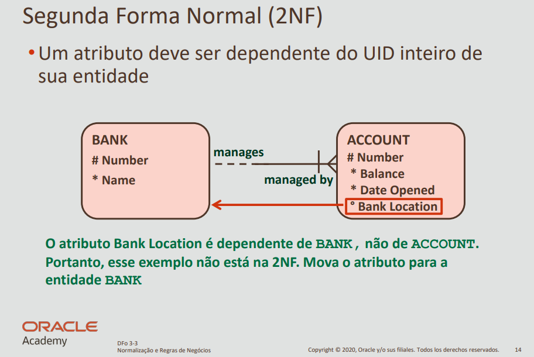

# Segunda Forma Normal (2NF)

A **Segunda Forma Normal (2NF)** é a segunda etapa do processo de normalização em bancos de dados relacionais. Ela se aplica a tabelas que **já estão na Primeira Forma Normal (1NF)** e trata de eliminar **dependências parciais** — ou seja, quando um atributo depende apenas de parte da chave primária.

---

## 🔹 Critérios da 2NF

Uma tabela está na Segunda Forma Normal quando:

1. **Está na Primeira Forma Normal (1NF)**.
2. **Todos os atributos não-chave dependem da chave primária completa**, e não apenas de parte dela.

⚠️ Isso é especialmente relevante quando a **chave primária é composta** (formada por duas ou mais colunas).

---

## 🔹 Benefícios da 2NF

✔️ Elimina redundâncias parciais  
✔️ Evita inconsistências e anomalias de atualização  
✔️ Facilita a manutenção da estrutura do banco  
✔️ Deixa as dependências funcionais mais claras

---

## 🔹 Exemplo 1: Tabela com Chave Composta

Considere a seguinte tabela `venda_produto`, onde a chave primária é composta por `id_venda` e `id_produto`:

| id_venda | id_produto | nome_produto | quantidade |
|----------|------------|--------------|------------|
| 1        | 10         | Teclado      | 2          |
| 1        | 11         | Mouse        | 1          |
| 2        | 10         | Teclado      | 1          |

🔍 **Problema**:
- O atributo `nome_produto` depende **apenas de `id_produto`**, e não da chave primária completa (`id_venda`, `id_produto`)  
→ Isso caracteriza uma **violação da 2NF**

### ✅ Solução:

**Separar os dados que não dependem da chave composta:**

```sql
CREATE TABLE produto (
  id_produto INT PRIMARY KEY,
  nome_produto VARCHAR(100)
);

CREATE TABLE venda_produto (
  id_venda INT,
  id_produto INT,
  quantidade INT,
  PRIMARY KEY (id_venda, id_produto),
  FOREIGN KEY (id_produto) REFERENCES produto(id_produto)
);
```
## 🔹 Exemplo 2: Atributo no Lugar Errado (Exemplo Oracle)

A imagem abaixo mostra um caso clássico de violação da 2NF, onde o atributo **Bank Location** está armazenado na entidade errada:



### 🔍 Análise

A entidade `ACCOUNT` armazena o atributo `Bank Location`.

No entanto, esse atributo não depende da conta (`ACCOUNT`), e sim do banco (`BANK`).

➡️ Isso configura uma **violação da Segunda Forma Normal**, pois `Bank Location` não depende da chave primária da tabela em que está inserido.

---

### ✅ Solução

Mover o atributo `Bank Location` para a entidade `BANK`, onde ele pertence logicamente e funcionalmente.

---

## 🔹 Resumo

| Situação                                                | Está em 2NF? |
|---------------------------------------------------------|--------------|
| Todos os atributos dependem da chave primária inteira   | ✅ Sim       |
| Algum atributo depende apenas de parte da chave         | ❌ Não       |

---

## 🔹 Quando aplicar a 2NF?

- Sempre que sua tabela possuir uma **chave composta**
- Sempre que identificar **atributos que não fazem sentido com parte da chave**
- Após garantir que a estrutura **já esteja em 1NF**
