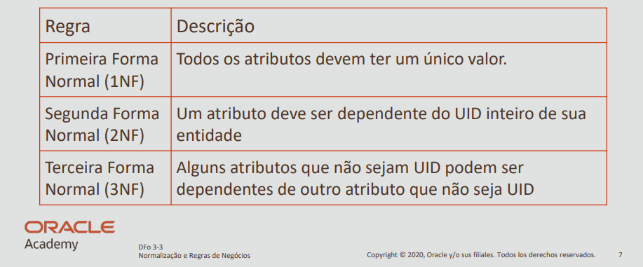

# Formas Normais (1NF, 2NF e 3NF)

Este diretório aborda o conceito de **normalização de dados** em bancos relacionais, com foco nas três primeiras **formas normais (1NF, 2NF e 3NF)**. Normalizar uma base significa organizar os dados para **eliminar redundâncias**, **aumentar a consistência** e **melhorar a integridade**.

---

## 🔹 O que é Normalização?

A normalização é um processo sistemático para organizar dados em tabelas relacionais, eliminando repetições e dependências desnecessárias. Ela é feita através da aplicação de **formas normais**, que são regras teóricas desenvolvidas por E. F. Codd e refinadas por outros pesquisadores.

---

## 🔹 Tabela de Regras

A imagem abaixo resume as três formas normais iniciais:

| Regra                        | Descrição                                                                 |
|-----------------------------|---------------------------------------------------------------------------|
| **1ª Forma Normal (1NF)**    | Todos os atributos devem conter um único valor (sem repetições ou listas). |
| **2ª Forma Normal (2NF)**    | Todos os atributos devem depender da **chave primária completa** (não apenas parte dela). |
| **3ª Forma Normal (3NF)**    | Os atributos devem depender apenas da **chave primária**, e não de outros atributos não-chave. |

---

## 🔹 Explicando as Formas Normais

### ✅ Primeira Forma Normal (1NF)

- Elimina **grupos repetitivos** ou **atributos multivalorados**.
- Cada campo da tabela deve armazenar **apenas um valor atômico**.

> Exemplo incorreto:  
> | id | nome   | telefones           |  
> |----|--------|---------------------|  
> | 1  | Maria  | (11) 1234, (11) 9999 |

> Exemplo correto (1NF aplicada):  
> | id | nome  | telefone    |  
> |----|-------|-------------|  
> | 1  | Maria | (11) 1234   |  
> | 1  | Maria | (11) 9999   |

---

### ✅ Segunda Forma Normal (2NF)

- Aplica-se quando existe uma **chave composta**.
- Nenhum atributo pode depender apenas de **parte da chave primária**.

> Exemplo incorreto:  
> | id_venda | id_produto | nome_cliente |  
> |----------|------------|---------------|

> Correção para 2NF: separar `nome_cliente` em outra tabela.

---

### ✅ Terceira Forma Normal (3NF)

- Elimina **dependências transitivas** (atributos que dependem de outro atributo que não seja a PK).

> Exemplo incorreto:  
> | id | nome  | id_estado | nome_estado |

> Correção para 3NF: mover `nome_estado` para uma tabela `estado` referenciada por chave estrangeira.

---

## 🔹 Por que Normalizar?

✔️ Reduz redundâncias  
✔️ Evita anomalias de inserção, exclusão e atualização  
✔️ Facilita manutenção e expansão do banco  
✔️ Melhora a integridade dos dados

---

Este conteúdo serve como base para criar bancos de dados **bem estruturados, otimizados e livres de inconsistências**.
